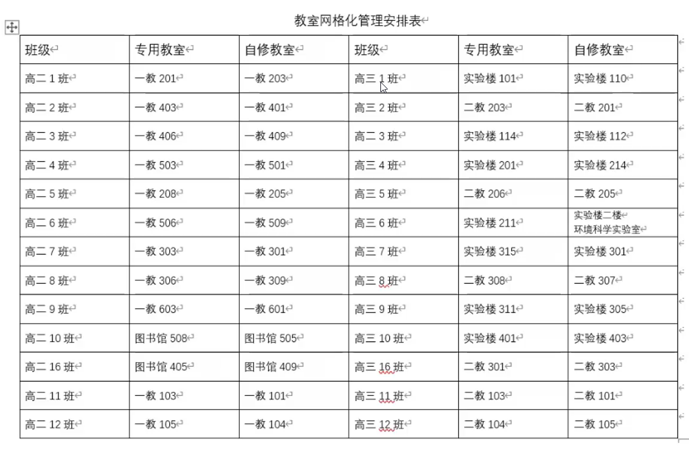

# 班会

[年级大会](/Grade conference/)

### 6.5

1. 方便做核酸：开设核酸点（非必须） for 学生教师 
2. 只要求绿码 + 72h 核酸阴性
3. 非返校，仅做核酸

### 数字哨兵

+ 24h 核酸阴性证明 （每天放学前学校提供专门核酸）
+ 随申码绿码
+ 抗原检测：疫测达
+ 体温正常

### 网格化，时间安排

除了规定时间上厕所外，禁止出班级

| 节次 | 时间        | 课程           |
| ---- | ----------- | -------------- |
| 1    | 08:30-09:10 | 自修           |
| 2    | 09:20-10:00 | 语数外/等级考  |
| 3    | 10:10-10:50 | 语数外/等级考  |
|      | 10:50-11:10 | 眼保健操       |
| 4    | 11:20-12:00 | 等级考答疑     |
|      | 12:00-13:10 | 午餐午休       |
| 5    | 13:10-14:10 | 等级考限时作业 |
| 6    | 14:20-15:00 | 等级考         |
| 7    | 15:10-15:50 | 等级考         |
| 8    | 16:00-16:40 | 体育+核酸      |
|      | 19:00-21:30 | 线上晚自习     |

### 学习

+ 不建议住校
+ 有问题：第一时间找老师